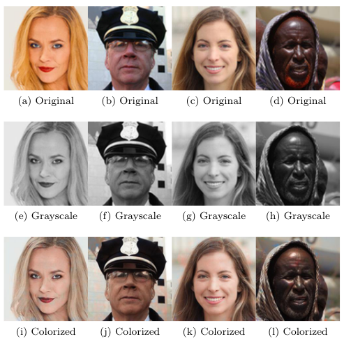

# AutoEncolor
This project presents an image colorization approach using advanced autoencoders and tools such as PyTorch, Python, NumPy, and Matplotlib. The focus is on transforming grayscale images into vibrant RGB images, with a particular emphasis on facial feature colorization. The project explores different network architectures, implements performance optimizations, and leverages a diverse faces dataset (Flickr-Faces-HQ) to achieve realistic and visually appealing results. While the main objective is facial colorization, there is potential for further development in background colorization. 




Usage:

To see full list of options:

`python autoencolor.py -h`

To colorize image (resizes image to 128x128):

`python autoencolor --image /path/to/image`

To train on a specific network (default is classic):

`python autoencolor --train --network reverse`

To train on a specific on training set* (default is medium):

`python autoencolor --train --mode tiny`

*Dataset should be split between train, validation, and test folders with a subfolder for category*

For example: 
```
├── data
│   ├── test_full
│   │   └── faces
│   ├── train_full
│   │   └── faces
│   ├── validation_full
│       └── faces
```


